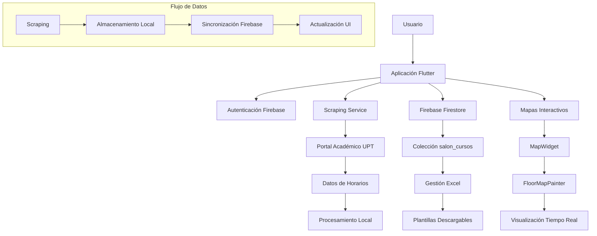
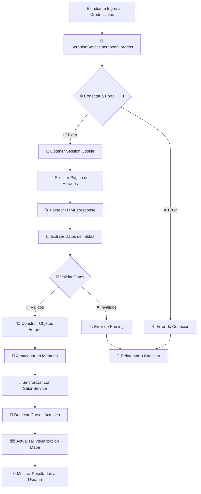
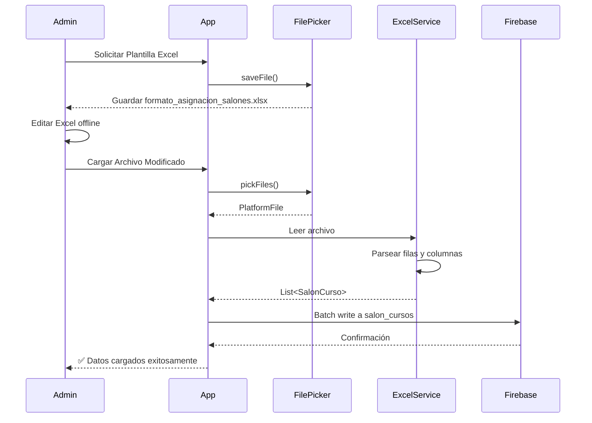

# MiSalón UPT - Sistema Inteligente de Gestión de Salones

## 📋 Resumen de la Aplicación

**MiSalón UPT** es una aplicación móvil inteligente desarrollada en Flutter para la Universidad Privada de Tacna (UPT) que permite a estudiantes y administradores gestionar y visualizar la ocupación de salones de clase en tiempo real. La aplicación combina scraping de datos académicos, Firebase para almacenamiento en la nube, y mapas interactivos para proporcionar una solución completa de localización y gestión de aulas.

### 🎯 Funcionalidades Principales

- **Para Estudiantes:**
  - Visualización de horarios personales obtenidos por scraping
  - Mapas interactivos del piso 3 con ubicación de salones
  - Destacado en tiempo real de salones con cursos activos
  - Información detallada de cada salón y su ocupación
  - Navegación intuitiva con zoom y gestos táctiles

- **Para Administradores:**
  - Panel de administración completo
  - Gestión de asignaciones salón-curso mediante Excel
  - Descarga de plantillas Excel para configuración masiva
  - Visualización de todos los salones y sus estados
  - Sistema de autenticación seguro

## 🏗️ Arquitectura del Sistema



## 🔧 Tecnologías Utilizadas

- **Frontend:** Flutter 3.9.2+ con Material Design 3
- **Backend:** Firebase Firestore
- **Autenticación:** Firebase Authentication  
- **Manejo de Archivos:** Excel 4.0.3, File Picker 8.1.2
- **HTTP Client:** HTTP 1.1.0 para scraping
- **UI Avanzada:** InteractiveViewer, CustomPainter

## 📂 Estructura del Proyecto y Archivos

### `/lib` - Código Principal

#### 🔐 **`main.dart`**
- **Propósito:** Punto de entrada de la aplicación
- **Funcionalidad:** Inicialización de Firebase, configuración de tema Material 3
- **Importancia:** Establece la base de toda la aplicación

#### 🔐 **`firebase_options.dart`**
- **Propósito:** Configuración generada automáticamente para Firebase
- **Funcionalidad:** Credenciales y configuración de conexión a Firebase
- **Nota:** Archivo generado por Firebase CLI

### `/lib/screens` - Pantallas de la Aplicación

#### 🏠 **`login_screen.dart`**
- **Propósito:** Pantalla principal con autenticación dual
- **Funcionalidades:**
  - Formulario de login para estudiantes (scraping)
  - Panel de administración con autenticación Firebase
  - Interfaz diferenciada según tipo de usuario
  - Mapas interactivos integrados
- **Componentes Clave:**
  - `_buildStudentLogin()`: Formulario de scraping
  - `_buildAdminPanel()`: Panel administrativo
  - `_buildMapSection()`: Visualización de mapas

#### 📅 **`schedule_screen.dart`** 
- **Propósito:** Pantalla de horarios del estudiante
- **Funcionalidades:**
  - Visualización de horarios obtenidos por scraping
  - Integración con sistema de salones
  - Destacado de cursos actuales y próximos
  - Información detallada de ubicaciones
- **Métodos Importantes:**
  - `_buildScheduleList()`: Lista de horarios
  - `_buildSalonesInfo()`: Información de salones del estudiante
  - `_buildCourseCard()`: Tarjetas de cursos individuales

#### ⚙️ **`admin_salon_screen.dart`**
- **Propósito:** Gestión administrativa de salones
- **Funcionalidades:**
  - Descarga de plantillas Excel
  - Carga de archivos de configuración
  - Visualización de asignaciones actuales
  - Gestión CRUD de salon_cursos
- **Flujo de Trabajo:**
  1. Descarga plantilla Excel → 2. Edición offline → 3. Carga a Firebase → 4. Sincronización

### `/lib/services` - Lógica de Negocio

#### 🌐 **`scraping_service.dart`**
- **Propósito:** Extracción de datos del portal académico UPT
- **Proceso de Scraping:**
  ```mermaid
  sequenceDiagram
      participant App
      participant Service
      participant Portal
      participant Firebase
      
      App->>Service: scrapearHorarios(codigo, password)
      Service->>Portal: POST /login
      Portal-->>Service: Session Cookie
      Service->>Portal: GET /horarios
      Portal-->>Service: HTML Response
      Service->>Service: parseHorarios(html)
      Service-->>App: List<Horario>
      App->>Firebase: Opcional: Guardar datos
  ```
- **Funciones Principales:**
  - `scrapearHorarios()`: Método principal de extracción
  - `_realizarLogin()`: Autenticación en portal
  - `_extraerHorarios()`: Parsing de HTML
  - `_construirHorario()`: Creación de objetos estructurados
- **Manejo de Errores:** Validación de credenciales, timeouts, parsing robusto

#### 🏢 **`salon_curso_service.dart`**
- **Propósito:** Gestión integral de salones y cursos
- **Funcionalidades Principales:**
  - **Gestión Excel:** Generación y lectura de plantillas
  - **Sincronización Firebase:** CRUD en colección salon_cursos
  - **Detección Tiempo Real:** Identificación de cursos activos
  - **Análisis Estudiante:** Mapeo personalizado de salones
- **Métodos Clave:**
  ```dart
  // Gestión Excel
  Future<void> descargarFormatoExcel()
  Future<void> cargarArchivoExcel(PlatformFile file)
  
  // Detección en tiempo real
  Future<List<SalonEstudiante>> obtenerSalonesEstudiante(List<Horario> horarios)
  bool _esCursoActual(Horario horario)
  bool _esProximoCurso(Horario horario)
  
  // Firebase Operations
  Future<void> guardarSalonCurso(SalonCurso salon)
  Stream<List<SalonCurso>> obtenerSalonesCursos()
  ```

### `/lib/models` - Modelos de Datos

#### 📊 **`horario.dart`**
- **Propósito:** Estructura de datos para horarios de estudiantes
- **Campos:**
  ```dart
  String codigo;          // Código del curso (ej: "MA001")
  String nombre;          // Nombre del curso
  String profesor;        // Docente asignado
  String salon;          // Salón asignado (ej: "307", "LAB-COMP")
  String dia;            // Día de la semana
  String horaInicio;     // Hora de inicio (HH:mm)
  String horaFin;        // Hora de fin (HH:mm)
  ```
- **Métodos:** `toJson()`, `fromJson()` para serialización

#### 🏫 **`salon_curso.dart`**
- **Propósito:** Modelo para asignaciones salón-curso en Firebase
- **Estructura:**
  ```dart
  String id;             // ID único en Firestore
  String salon;          // Identificador del salón
  String codigoCurso;    // Código del curso asignado
  String nombreCurso;    // Nombre descriptivo del curso
  String dia;            // Día de la semana
  String horaInicio;     // Hora de inicio
  String horaFin;        // Hora de fin
  DateTime fechaCreacion; // Timestamp de creación
  ```

#### 🎓 **`salon_estudiante.dart`**
- **Propósito:** Modelo especializado para visualización de estudiantes
- **Funcionalidad:** Combina datos de scraping con estados en tiempo real
- **Campos Especiales:**
  ```dart
  bool esCursoActual;    // Si el curso está activo ahora
  bool esProximoCurso;   // Si el curso es el siguiente
  bool tieneCursoHoy;    // Si tiene cursos hoy en este salón
  ```

### `/lib/widgets` - Componentes Reutilizables

#### 🗺️ **`map_widget.dart`**
- **Propósito:** Widget de mapa interactivo del piso 3
- **Características:**
  - Zoom y navegación con gestos
  - Destacado dinámico de salones
  - Integración con datos en tiempo real
  - Responsivo y optimizado
- **Estados de Visualización:**
  - **Verde:** Salón con curso actual
  - **Amarillo:** Próximo curso
  - **Azul:** Tiene cursos en el día
  - **Gris:** Sin actividad relevante
- **Componentes:**
  - `InteractiveViewer`: Control de zoom y pan
  - `FloorMapPainter`: Renderizado personalizado del mapa
  - Sistema de leyenda dinámico

#### 🎨 **`floor_map_painter.dart`**
- **Propósito:** Renderer personalizado para el mapa del piso
- **Tecnología:** CustomPainter de Flutter
- **Funcionalidades:**
  - Dibujo preciso de salones y pasillos
  - Efectos visuales (brillos, sombras)
  - Colores dinámicos basados en estado
  - Optimización de rendimiento
- **Métodos Principales:**
  - `paint()`: Renderizado principal
  - `_drawClassroom()`: Dibujo de salones individuales
  - `_drawGlowEffect()`: Efectos de brillo para cursos activos

## 🔄 Flujo de Scraping de Datos

El proceso de extracción de datos sigue este flujo detallado:



### Detalles Técnicos del Scraping

1. **Autenticación:**
   - POST a endpoint de login con credenciales
   - Captura de cookies de sesión
   - Validación de respuesta de autenticación

2. **Extracción de Datos:**
   - GET a página de horarios con session cookie
   - Parsing de HTML usando RegExp y string manipulation
   - Extracción de campos: código, nombre, profesor, salón, día, horas

3. **Procesamiento:**
   - Limpieza y normalización de datos
   - Validación de formatos (horas, códigos)
   - Construcción de objetos tipados

4. **Manejo de Errores:**
   - Timeouts de conexión
   - Credenciales inválidas
   - Cambios en estructura HTML
   - Problemas de parsing

## 🔥 Integración con Firebase

### Estructura de Firestore

```
misalon-upt/
├── salon_cursos/          # Colección principal
│   ├── doc1/             # Documento por asignación
│   │   ├── id: "auto"    # ID automático
│   │   ├── salon: "307"  # Identificador salón
│   │   ├── codigoCurso: "MA001"
│   │   ├── nombreCurso: "Matemática I"
│   │   ├── dia: "Lunes"
│   │   ├── horaInicio: "08:00"
│   │   ├── horaFin: "10:00"
│   │   └── fechaCreacion: timestamp
│   └── doc2/...
└── usuarios/              # (Futuro) Gestión de usuarios
```

### Flujo Excel-Firebase



## 🎨 Sistema de Visualización

### Estados del Mapa

El mapa utiliza un sistema de colores inteligente:

| Color | Estado | Descripción |
|-------|---------|-------------|
| 🟢 **Verde** | Curso Actual | El estudiante tiene clase ahora en este salón |
| 🟡 **Amarillo** | Próximo Curso | El siguiente curso será en este salón (próximos 30 min) |
| 🔵 **Azul** | Curso del Día | Tiene cursos programados hoy en este salón |
| ⚫ **Gris** | Sin Actividad | No hay cursos relevantes para el estudiante |

### Efectos Visuales

- **Glow Effect:** Los salones con cursos actuales tienen un efecto de brillo
- **Animaciones Suaves:** Transiciones fluidas entre estados
- **Zoom Inteligente:** El mapa se centra automáticamente en salones relevantes
- **Leyenda Dinámica:** Se actualiza según el contexto del usuario

## 📱 Instalación y Configuración

### Requisitos Previos

- Flutter SDK 3.9.2 o superior
- Dart 3.0.0 o superior  
- Android Studio / VS Code
- Cuenta Firebase configurada

### Pasos de Instalación

1. **Clonar el repositorio:**
   ```bash
   git clone [repository-url]
   cd misalon
   ```

2. **Instalar dependencias:**
   ```bash
   flutter pub get
   ```

3. **Configurar Firebase:**
   ```bash
   firebase login
   flutterfire configure
   ```

4. **Ejecutar la aplicación:**
   ```bash
   flutter run
   ```

### Dependencias Principales

```yaml
dependencies:
  flutter: sdk: flutter
  firebase_core: ^2.24.2          # Firebase Core
  cloud_firestore: ^4.13.6        # Firestore Database  
  firebase_auth: ^4.15.3          # Authentication
  http: ^1.1.0                    # HTTP Client para scraping
  excel: ^4.0.3                   # Manejo de archivos Excel
  file_picker: ^8.1.2             # Selector de archivos
  shared_preferences: ^2.2.2      # Almacenamiento local
```

## 🚀 Uso de la Aplicación

### Para Estudiantes

1. **Inicio de Sesión:**
   - Ingresar código de estudiante y contraseña del portal UPT
   - El sistema realizará scraping automático de horarios

2. **Visualización de Horarios:**
   - Ver lista completa de cursos programados
   - Identificar cursos actuales y próximos
   - Acceder a información detallada de cada curso

3. **Navegación en Mapas:**
   - Usar gestos de zoom y desplazamiento
   - Tocar salones para ver información detallada
   - Seguir destacado visual para encontrar ubicaciones

### Para Administradores

1. **Acceso Administrativo:**
   - Usar credenciales de administrador Firebase
   - Acceder al panel de gestión completo

2. **Gestión Excel:**
   - Descargar plantilla de configuración
   - Editar asignaciones offline
   - Cargar archivo modificado para sincronización masiva

3. **Monitoreo:**
   - Visualizar todas las asignaciones activas
   - Verificar integridad de datos
   - Gestionar configuraciones del sistema

## 🔧 Mantenimiento y Escalabilidad

### Monitoreo

- **Firebase Console:** Métricas en tiempo real
- **Flutter DevTools:** Debug y performance
- **Logs Estructurados:** Seguimiento de errores de scraping

### Actualizaciones

- **Scraping:** Adaptar a cambios en portal UPT
- **UI/UX:** Mejoras continuas de interfaz
- **Firebase Rules:** Seguridad y optimización

### Escalabilidad

- **Caché Local:** Minimizar requests de red
- **Batch Operations:** Operaciones masivas eficientes  
- **Lazy Loading:** Carga progresiva de datos grandes

## 👥 Contribución

Este proyecto fue desarrollado como parte del curso de Soluciones Móviles I en la UPT. Para contribuir:

1. Fork del repositorio
2. Crear branch feature (`git checkout -b feature/nueva-funcionalidad`)
3. Commit cambios (`git commit -am 'Agregar nueva funcionalidad'`)
4. Push al branch (`git push origin feature/nueva-funcionalidad`)
5. Crear Pull Request

## 📄 Licencia

Este proyecto es desarrollado con fines educativos para la Universidad Privada de Tacna (UPT).

---

**Desarrollado con ❤️ usando Flutter y Firebase**

*Sistema inteligente para la gestión moderna de espacios académicos universitarios*
